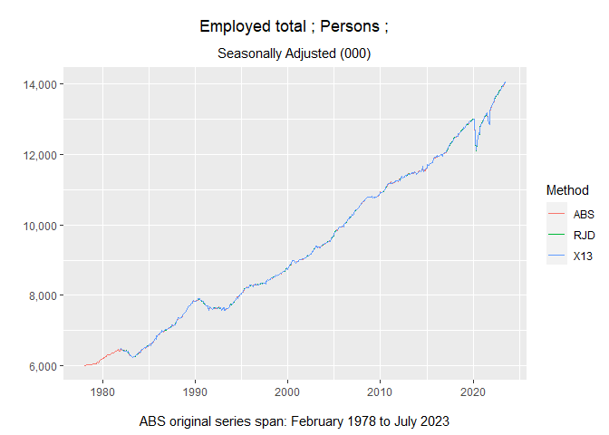

<!-- README.md is generated from README.Rmd. Please edit that file -->

## Seasonal adjustment and trending

A time series is a collection of well-defined data observed regularly
through time. Seasonal adjustment is an analytical method to estimate
and remove seasonal and calendar-related impacts from a time series.
Trending is an analytical method to estimate the long-term, underlying
direction of a time series.

The `timeseriescomparions` package enables the comparison of the
seasonal adjustment and trending methods produced by the following three
programs:

- [SEASABS](https://www.abs.gov.au/websitedbs/d3310114.nsf/4a256353001af3ed4b2562bb00121564/c890aa8e65957397ca256ce10018c9d8!OpenDocument)
  (used by Australia’s national statistical agency)

- [X-13ARIMA-SEATS](https://www.census.gov/data/software/x13as.html)
  (used by the United States Census Bureau)

- [JDemetra+](https://jdemetradocumentation.github.io/JDemetra-documentation/)
  (used by many European statistical agencies and central banks)

Published seasonally adjusted and trend estimates of time series data
from the Australian Bureau of Statistics (generated via SEASABS) are
compared against the output generated by executing the X-13ARIMA-SEATS
and JDemetra+ programs. Since SEASABS is not freely available, the
estimates are referenced directly via their publications on the web. The
other two programs are readily accessible however, and are run via their
R interfaces:

- The R package `seas` is used to run X-13ARIMA-SEATS

- The R package `RJDemetra` is used to run JDemetra+ (version 2)

Importantly, the default values of both packages have been used when
running the seasonal adjustment and trending algorithms.

## ABS time series data

The [Australian Bureau of Statistics](https://www.abs.gov.au/) (ABS)
produces seasonally adjusted and trend estimates for various
publications containing original time series. The relevant data are
contained in various tables as Excel spreadsheets under the ‘Data
downloads’ section of the desired publication.

An example is *Table 1. Inventories, chain volume measures* in the March
2023 publication of ‘Business Indicators, Australia’ available at:

<https://www.abs.gov.au/statistics/economy/business-indicators/business-indicators-australia/mar-2023/5676001.xlsx>

Each spreadsheet file contains the following sheets/tabs:

- **Index:** contains metadata about the time series, such as the series
  type, units and frequency

- **Data1:** contains the original, seasonally adjusted and trend
  estimates (any other tabs are ignored in this analysis)

Note that the ABS does not publish seasonally adjusted and trend
estimates for all original time series.

## Installation

You can install the development version of `timeseriescomparison` from
[GitHub](https://github.com/) with:

``` r
# install.packages("devtools")
devtools::install_github("a-s-russo/time-series-comparison@fusen")
```

## Example

Compare the seasonally adjusted series for all employed persons in
Australia between SEASABS, X-13ARIMA-SEATS, and JDemetra+:

``` r
# Load the package
library(timeseriescomparison)

# Download Australian labour force data
emp <- download_ts("https://www.abs.gov.au/statistics/labour/employment-and-unemployment/labour-force-australia/jul-2023/6202001.xlsx")

# Plot the seasonally adjusted series
create_tsplot_comp(emp, "Employed total ;  Persons ;", "S")
```


